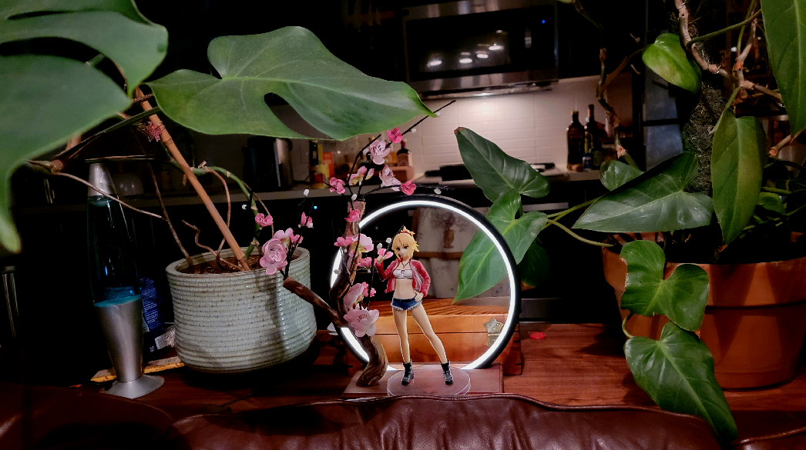

# Display Ring 


### Background
I Bought a nice display stand which had an LED ring on it.

However, the stand ran on USB with a an in-line controller which always defaulted to off when first powered, making it impossible to automate or switch remotely.  

I replaced the in-line controller with a D1 mini I had lying around so I could control it via Home Assistant. 

### The build


## Controlling the LED ring 
Since the LED ring ran on 5V and pulled more current then the D1 Mini I needed to add a transister. 

None of my transisters had a low enough voltage floor to work with the D1's 3.3v logic voltage. After literally hours digging through my hacker space's boxes of loose misc. electrical componenets I dug up a [Motorolla 2N4401](https://www.westfloridacomponents.com/mm5/graphics/Q05/2N4401-Motorola.pdf). It's not ideal, NPN transisters are analogue, so I had to pair it with a tuned transister to get maximum brightness without over-drawing current or toasting things. Ultimately I paired it with a 2.2k Ohm resister.

### Wiring for this YAML config
- D2 (GPIO4) -> 22K resister -> Base (Pin 2)
- USB Ground -> Emitter (Pin 1)
- LED ring ground -> Collector (Pin 3)

```
# Display ring 
output:
  - platform: esp8266_pwm
    pin: GPIO4
    frequency: 1000 Hz
    id: pwm_output
    inverted: false

light:
  - platform: monochromatic
    name: "Display Ring"
    id: displayring
    output: pwm_output
    effects:
      - flicker:
          name: "Flicker"
          alpha: 95%
          intensity: 5%
      - pulse:
          name: "Slow Pulse"
          # transition_length: 1s      # defaults to 1s
          update_interval: 2s
```

#### For Next Time
A MOSFET would have been a much easier thing to work with. So, as-per usual I wound up ordering as many parts AFTER the project completes as I did to prepare for it.

Next time I do something like this I'll have an [IRF610](https://www.vishay.com/docs/91023/irf610.pdf) 3.3v MOSFET handy. 

## (re)Adding local control
Seeing as I just cut out all the buttons which controlled it locally and I couldn't be bothered to make an enclosure I added a [SW-18010P](https://www.amazon.com/dp/B07S8HGL31) vibration sensor. 

As an added bonus earthquakes will result in my home turning into a full-on lightswitch rave. 

### Wiring for this YAML config
- D1 mini Ground ->  Either pin
- D3 (GPIO0) -> Either pin 

```
# Vibration sensor on D3 (GPIO0)
binary_sensor:
  - platform: gpio
    pin:
      number: GPIO0
      mode: INPUT_PULLUP
    name: "Tap Sensor"
    device_class: vibration
    filters:
      - delayed_on: 10ms
      - delayed_off: 10ms
    on_press:
      then:
        - light.toggle: 
            id: displayring
```

#### For Next Time
The D1 is only picking up every couple strikes on the vibration sensor, making me think there might be some issues with how breif the spring is actually in contact with the wall of the sensor.

Messing with the de-bouncing filters might resolve this. 

