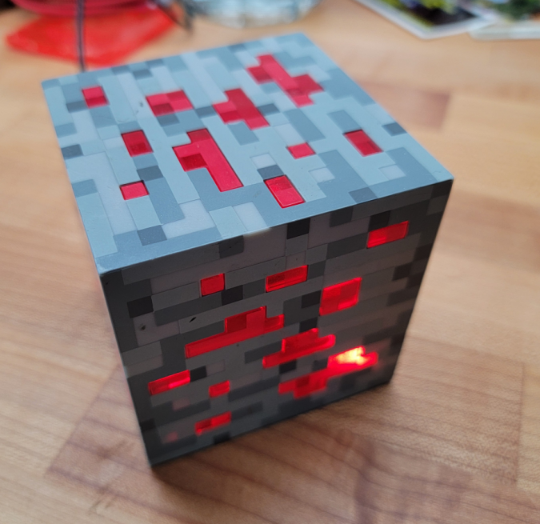

# Minecraft Block Project
Bought a ThinkGeek Minecraft Ore block at a swap meet for literally 1 dollar.



Figured it would be cool to have real redstone automation in my home and wanted to mess with ESPHome anyway, so I bodged in some random parts I had around the house. 


[!NOTE]
Yes, this picture sucks and I didn't draw up a wiring diragram. The text notes would be enough for me to be able to re-create this but if you're following in my footsteps and need the digram please DM me and I can draw one up. 

#### Block I modded (didn't purchase here)
https://www.amazon.com/ThinkGeek-Minecraft-Light-Up-Redstone-ore-508-l/dp/B078V4B8WZ

## How it's wired
#### Power
Didn't want to mess with sleeping and batteries so I just hooked it up to a USB cable via a 3.3v regulator.

In retrospect I should have used a D1 mini instead of an ESP-01S as the single most expensive part in the thing turned out to be the 3.3v regulator. If I re-do this I'll use a D1 or a similar ESP package that can be powered by 5v

That said, if you're following in my footsteps I used an **LM1117T** 3.3v linear regulator. 
https://www.ti.com/lit/ds/symlink/lm1117.pdf 

#### LEDs
Total drain on the LEDs was well-within the ratings of my ESP-01S so they are directly wired from the LED's collective **ground** to **GPIO0**. This would be a bad idea if there were more or higher-current LEDs, but as-is this is fine. 

#### Shock Sensor
This wound up being my favorite bit of the whole project, the shock sensor is just a sprint coil in a metal tube, when shocked the spring hits the side of the tube and breifely connects the circuit. 

It's just wired from **ground** to **GPIO2**. 

Note that it needs a pull-up resister and to be de-bounced, all of which the ESP-01S can do in-software. All this is baked into the YAML configuration. 

The **SW-18010P** vibration sensor was just harvested from the minecraft block's origional control board, but I liked working with this package so much I've since bought a pack for future projects: 
https://www.amazon.com/dp/B07S8HGL31

## Automating

ESPHome lets you do some basic automation locally within the device, which is perfect for things like having the lights flicker when the block is struck. 

The below YAML block added to the vibration sensor tells the ESPHome to turn on the lights in flicker mode for 3 seconds whenever the block is struck. 

```
...
    on_press:
      then:flicker the 
        - light.turn_on: 
            id: ore_lights
            effect: "Flicker"
        - delay: 3s
        - light.turn_off:
            id: ore_lights```